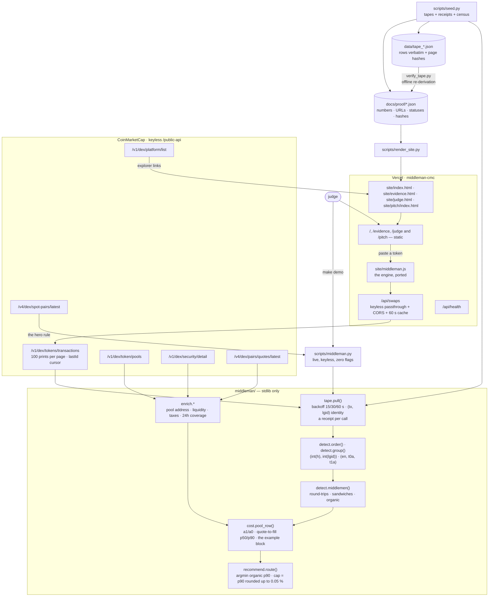

# Architecture

Derived from the code in this repository, not from a design document. Every function named
below exists in `middleman/`, `scripts/` or `api/`; every route listed is one the deployment
serves; every dependency is in a manifest. If a claim here is not greppable, it is a bug in
this file.

## Shape of the thing

Middleman is **one pass over a paginated feed: order, group, join, divide, rank.** There is no
database, no model, no cache in the product path and no key anywhere. The engine is six
stdlib-only Python modules; the page is static HTML rendered from committed receipts; one
serverless function exists solely to add a CORS header CoinMarketCap omits.



## The six fields the whole product rests on

`/v1/dex/tokens/transactions` returns one object per swap. The join needs six of its fields;
everything else is carried for provenance.

| Field | Type on the wire | What it makes possible |
|---|---|---|
| `ma` | address | **The maker.** "The same wallet on both sides of a block" becomes a count, not a suspicion. |
| `h` | **string** | **The block.** Both legs of a middleman are in one block; cast to `int` before comparing. |
| `lgid` | **string** | **The position inside the block.** "Between" is exact — a log index, not a timestamp. Cast to `int`. |
| `tp` | `"buy"` \| `"sell"` | The side, so two legs can be opposite. |
| `a0`, `a1` | numbers | Base and quote amounts. `a1 / a0` is the price a print paid; `\|Δa0\| / a0 ≤ 5 %` is the size match. |
| `en`, `t0a`, `t1a` | string \| null, addresses | The pool, reconstructed — the feed carries no pool address. |

`tx` is carried for the same-transaction flag and the explorer link; `(tx, lgid)` is the only
unique key across pages. `v` (USD) weights the round-trip share of volume. `q` is **not**
read: it is rounded or zero on Uniswap v4 rows (`FEEDBACK.md` #4).

## The arithmetic, in full

Per pool, in chain order. `middleman/detect.py`, `cost.py`, `recommend.py`:

```
legs(a, b)     = a.ma == b.ma and int(a.h) == int(b.h) and a.tp != b.tp
                 and |b.a0 − a.a0| / a.a0 ≤ 0.05

for each print a by wallet A, not yet a leg:
    b        = A's NEXT print in the same block            (none → a is organic so far)
    between  = the prints strictly between a and b
    if legs(a, b):
        take = b.a1 − a.a1  if a is a buy  else  a.a1 − b.a1
        sandwich   if 1 ≤ |between| ≤ 4 and every one is another maker printing in
                   a's direction, none already a leg, and take > 0     (between = victims)
        round-trip otherwise                                          (between recorded)

organic        = prints that are neither leg of a match       (victims stay organic)
q_i            = a1_i / a0_i
q2f_i          = (q_i / q_{i−1} − 1) × 1e4   for a buy        over consecutive ORGANIC prints
                 (1 − q_i / q_{i−1}) × 1e4   for a sell        adverse-signed
p50, p90       = nearest-rank, rank = ceil(p/100 × n)          always a real observation
route          = argmin organic p90 among pools with ≥ 50 organic prints
cap            = ceil(p90 / 5 bps) × 0.05 %,  never below 0.05 %
```

`naive` is the same q2f series over all prints, legs included, computed only so it can be shown
losing: on the hero pair it read 55.3 bps against 15.5 organic.

## Failure handling

Every failure mode maps to a distinct outcome, because conflating them is how a tool ends up
blaming a token for an outage. `middleman/tape.py`:

| Condition | Behaviour |
|---|---|
| HTTP 429 / any 5xx / connection dropped mid-request | Transient. Retried up to 3 times, 15 s → 30 s → 60 s. |
| Transient on every retry | Throttled. Returned with `throttled: True`; pages that already landed are kept and the window is marked partial and said out loud. When nothing landed, the CLI exits **75** (`EX_TEMPFAIL`) with the two ways through. |
| Any other 4xx | Permanent. Returned at once — retrying a 400 wastes the reader's time. |
| DNS / refused / timeout | The caller's network. Returned as an error, **not** flagged as throttling. |
| Malformed JSON | A contract problem. Returned at once. |
| Any HTTP error body | Described by `describe_http_error()` as the status, CMC's error code and message — never a body sliced mid-string. |
| A label call fails (`enrich.*`) | The table still renders; that label is blank. Context never takes down a run that has its number. |

`pull()` returns `(prints, meta)` so an API error can never be reported as a property of the
token. Every call — success or failure — leaves a receipt: URL, status, UTC, elapsed, sha256 of
the body.

## Routes (the deployment)

| Route | Type | Serves |
|---|---|---|
| `/` | static | `site/index.html` — the table, the route line, the raw rows, the census strip, the receipt, the paste box. Rendered for the hero token; the Ethereum receipts are embedded so the token buttons switch tables with zero requests. |
| `/evidence` | static | `site/evidence.html` — every call behind every receipt: URL, HTTP status, UTC, hash, credits; the rules verbatim; the endpoints table. |
| `/judge` | static | `site/judge.html` — one page for one reader: the claim, the 30-second path, the receipt block, the real reproduce command with the replay labelled apart, the limitations, the links. Rendered from the same receipts; mirrors `JUDGE.md`, and `tests/test_judge_surface.py` serves it and asserts 200 + the claim with no credentials. |
| `/pitch/` | static | `site/pitch/index.html` — the pitch deck, twelve slides rendered from the same receipts through `scripts/site_templates/deck.html`; the version stamp is the package's declared version (`middleman.__version__`, the string the CLI prints first). |
| `/api/swaps` | serverless (`api/swaps.js`) | `GET ?platform=&address=[&lastId=]` → the identical keyless CMC URL, body returned untouched under `raw`, plus `Access-Control-Allow-Origin: *` and `Cache-Control: s-maxage=60`. Upstream status passed through; a 429 comes back as a 429 with the CLI command as `hint`. Validates the platform and the address shape; holds no key. |
| `/api/health` | serverless (`api/health.js`) | Server clock, the receipts' capture time, the census totals. No upstream call. |

`scripts/serve.js` serves the same six locally on port 8101, so the paste box runs from a
fresh clone without Vercel. The canonical host is `middleman.edycu.dev`, a custom domain on the
same Vercel project as `middleman-cmc.vercel.app`; both serve this build and on both the paste
box calls `/api/swaps` same-origin. Served from anywhere else the page reaches the canonical
host by absolute URL (`API_BASE` in `site/middleman.js`) — both functions send
`Access-Control-Allow-Origin: *` and answer `OPTIONS`, and the request carries no custom
header, so it needs no preflight. `api/swaps.js` is the only code with any privilege — a public,
unauthenticated function on a shared IP — and `tests/test_proxy_boundary.py` drives it under
node with `fetch` stubbed to prove its boundary: it can reach exactly one keyless
CoinMarketCap URL, refuses any other host, path, platform or cursor without a call, and never
forwards a caller's key, token, cookie or forwarded-host header upstream.

## Repository layout

```
middleman/
  tape.py         the fetch: keyless GET with backoff, receipts, the lastId cursor, (tx, lgid) identity
  detect.py       order · group · middlemen — the join
  cost.py         a1/a0 · quote-to-fill · percentiles · pool_row · the example block
  recommend.py    route · cap_pct
  enrich.py       hero_pair · token_pools · label_pools · security · pair_quotes · platforms
  cli.py          analyse · compute · render · main — the table and the receipt
scripts/
  middleman.py    the door a judge walks through (python3 scripts/middleman.py)
  spike.py        the day-1 question, answered live → docs/proof/spike.json
  seed.py         the hero rule per chain + the watchlist → data/ + docs/proof/ + census.json
  verify_tape.py  every receipt re-derived from its tape, offline; exit 1 on drift
  bench.py        p50/p95 of the fetch (live) and the engine (replay)
  render_site.py  docs/proof/*.json → site/ through slot templates; --check gates drift
  check_submission_readiness.py   placeholders and stale test counts
  serve.js        site/ + api/ locally, the way Vercel routes them
  site_templates/ index.html · evidence.html · judge.html · deck.html
site/
  index.html · evidence.html · judge.html · pitch/index.html   generated — edit the templates or the receipts, never the page
  middleman.js    the engine ported to the browser + the page's interactions
  assets/         icon, social card, three OFL fonts
api/
  swaps.js · health.js         the two Vercel functions
data/
  tape_<sym>.json             10 tapes, rows verbatim, page hashes — the raw material
docs/
  METHOD.md                   the definitions, the invariant, the exclusions
  proof/                      spike.json · live_run.json · <sym>.json ×10 · census.json ·
                              platforms.json · bench_live.json · bench_replay.json
tests/                        145 tests: 139 offline, 6 live
```

## Dependencies

| | |
|---|---|
| Runtime | **none** — `requirements.txt` is a comment. Python 3.11 standard library: `urllib`, `json`, `hashlib`, `math`, `statistics`, `time`. |
| Serverless | Node 20 `fetch`, `fs`, `path`. No `package.json`, no `node_modules`. |
| Dev only | `pytest`, `pytest-cov`, `ruff`, `pip-audit`, `hypothesis` (`requirements-dev.txt`). `node` for the parity test and the local server. |

## Deliberate non-architecture

| Not present | Why |
|---|---|
| Database | Every number is recomputed from a fetch or a committed tape. There is nothing to persist. |
| Cache in the product | A cached tape is a stale tape; the claim is about the current window. The proxy's 60 s CDN cache exists only so ten judges pasting one token are one upstream call. |
| A key | Every endpoint the product calls is on `/public-api`. `CMC_API_KEY` is accepted as an escape hatch for a throttled IP — read from the environment at call time, never from disk, never printed, never in the deployment — and a keyed run says so on its first line and in its receipt. |
| MEV labels, mempool data, bundle data | Not available on this API, and not needed: a middleman has to print, and the print order names them. |
| Sandwich prevalence as the headline | Measured at 2 in 8,000 prints. The README says so; the detector stays because a zero it can prove is worth more than a rate it cannot. |
| A framework, a bundler, a font CDN | One HTML file per page, one script, three self-hosted fonts. The page makes zero requests to render. |
