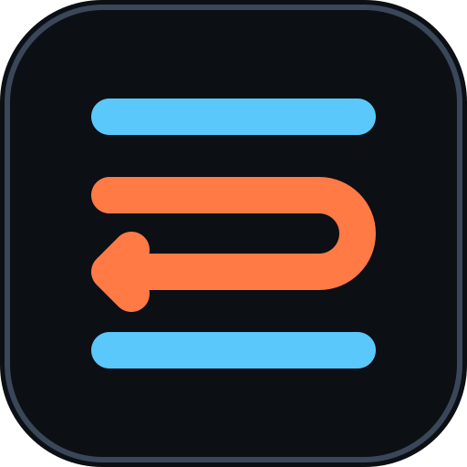

<div align="center">



<h1>Middleman</h1>

<p><em>Who stands between your quote and your fill, per pool.</em></p>



<p>A DEX trader sees a quote and a fill and cannot tell what stood between them — a wallet
printing on both sides of the block, or the pool itself. Middleman orders a token's real
prints by block and log index, joins them on the maker address, names the middleman, and
says where to route and what slippage cap to set.</p>

<p><strong>Live, keyless, 2026-09-18T22:36Z:</strong> CoinMarketCap's #1 Uniswap v2 pair on
Ethereum by transactions was busy with itself — <strong>66.2 % of its volume was 3 wallets
buying back what they just sold, inside one transaction</strong>, 29 times in 3.6 hours. Take
the legs out and an organic fill there pays 15.5 bps, not the 55.3 the raw tape implies.
800 prints in <strong>8.6 s</strong> for <strong>0 credits</strong>.
<a href="DEMO.md">Receipt →</a></p>

<br/>

[](JUDGE.md)
[](https://middleman-cmc.vercel.app)
[](https://middleman-cmc.vercel.app/judge)
[](https://middleman-cmc.vercel.app/evidence)
[](FEEDBACK.md)
[](https://dorahacks.io/hackathon/coinmarketcap-api-202609/detail)

<br/>


[](https://github.com/edycutjong/middleman/actions/workflows/ci.yml)


[](LICENSE)

</div>

---

## 📸 See it in Action

No key. No signup. No install. One command:

```bash
python3 scripts/middleman.py
```

```
middleman 0.1.0 — keyless, live

hero rule: the base token of the #1 Ethereum Uniswap v2 pair by 24h transactions at capture time
  → MOTO/WETH  0xbd965230588eaa536de6aa45e8ebbc01638535e0

MOTO · ethereum · 800 prints · 3.86 h · blocks 26006381–26007537 · captured 2026-09-18T23:00:20Z · keyless

  27.5% of Uniswap v2 / WETH volume is 1 wallet(s) buying back what they just sold (8 round-trips, same transaction)

  pool                         prints organic  round-trips                sandw  q→fill p50 / p90     tax     liq
  ----------------------------------------------------------------------------------------------------------------
  Uniswap v2 / WETH               771     755  8 · 1 wallet(s) · 27.5%        0  39.2 / 60.8 bps      0/0   $954k  ◀ route
  Uniswap v2 / USDC                16      16  —                              0  70.4 / 137.8 bps     0/0    $39k
  Uniswap v2 / USDT                13      13  —                              0  71.1 / 135.2 bps     0/0    $34k

  ▶ route via Uniswap v2 / WETH · cap slippage at 0.65 %   (organic p90 60.8 bps, 1 candidate pool(s))
    rule: lowest organic p90 quote-to-fill among pools with ≥ 50 organic prints
    coverage: this window is 16% of the routed pool's 24h transactions (4969: 2696 buys / 2273 sells)

  block 26006381 — raw rows (round-trip)
    lgid   633  0x9c97c0a6a0…  sell a0       505,623.1418  a1       0.625752  a1/a0 1.2376e-06  ◀ leg
    lgid   642  0x9c97c0a6a0…  buy  a0       497,596.3088  a1       0.619495  a1/a0 1.2450e-06  ◀ leg
    lgid   721  0xdbde0f745f…  buy  a0           240.4182  a1       0.000300  a1/a0 1.2494e-06
    leg 1  lgid 633  0x9c97c0a6a00b1a9f74dbe09a4c55ec9f09f8af7d  sell  a1/a0 = 0.6257523552405421 / 505623.14176740864 = 1.2375864622280164e-06
    leg 2  lgid 642  0x9c97c0a6a00b1a9f74dbe09a4c55ec9f09f8af7d  buy  a1/a0 = 0.6194948316881366 / 497596.3088161665 = 1.2449747329556753e-06
    same wallet · same block 26006381 · same tx · |Δa0| / a0 = 0.0159 ≤ 0.05 → round-trip

wrote docs/proof/live_run.json  (11.3s wall clock, 0 credits — keyless)
```

> **That is a live call to CoinMarketCap's keyless `/public-api` surface. Nothing here is a
> fixture.** This transcript is from **2026-09-18T23:00:18Z** (run with `--json` so the receipt
> was kept: [`docs/proof/live_run.json`](docs/proof/live_run.json); the bare command prints the
> same table). The page — and the numbers at the top of this file — come from the capture
> `scripts/seed.py` made **24 minutes earlier** with the same engine and the same rule, when the
> same wallets were **66.2 %** of the pool's volume across 29 round-trips
> ([`docs/proof/moto.json`](docs/proof/moto.json), the 800 raw prints in
> [`data/tape_moto.json`](data/tape_moto.json)). Between the two runs they went quiet; a third
> run the next morning found the window **clean** — zero round-trips, and the tool said so
> ([`docs/proof/live_run_clean.json`](docs/proof/live_run_clean.json)). Run it yourself and the
> number will differ again, because it comes from the market rather than from this file — and
> `python3 scripts/verify_tape.py` re-derives every committed receipt from its tape with the
> network unplugged. All three transcripts are in **[DEMO.md](DEMO.md)**.

**Read the two orange rows.** Same maker, same block, same transaction hash: sell 505,623 MOTO,
buy 497,596 MOTO back, 1.6 % apart. Divide `a1` by `a0` and you have the price each leg paid.
In the capture behind the page that wallet and two others did it 29 times — $127,254 of the
pool's $192,275 — and the pair sits at the top of CoinMarketCap's activity ranking because of them.

**The same table, in a browser:** [middleman-cmc.vercel.app](https://middleman-cmc.vercel.app)
renders the capture with the raw rows one click away, every request behind it on
[/evidence](https://middleman-cmc.vercel.app/evidence), and a paste box that runs the same
engine live on any token. One page for judges, no key and no setup:
[/judge](https://middleman-cmc.vercel.app/judge).

---

## 💡 The Problem & Solution

### The Problem

Every DEX tool shows a trader two numbers before a swap — a quote and a slippage tolerance —
and one after: the fill. The gap between them has three possible authors: a sandwicher printing
around her inside the block, a wash bot whose round-trips make a pool look deep, or the pool's
own thinness. Nothing tells her which. So she picks the pool with the most transactions (the one
most likely to be washed) and sets a loose cap "to be safe" (the one thing a sandwicher needs).
Every flow tool prints volume and transaction counts — exactly the numbers a round-tripping
wallet inflates.

### The Solution

CoinMarketCap's `/v1/dex/tokens/transactions` returns, per swap and with no key, the **maker
address** (`ma`), the **block** (`h`), the **log index** (`lgid`), the side and both amounts.
Order the prints by `(h, lgid)`, group them into pools by `(venue, base, quote)`, and join on
the maker:

| Shape | Definition | What it is |
|---|---|---|
| **Round-trip** | the same wallet's next print in the block is the other side, size within 5 % | buying back what it just sold — usually inside one transaction |
| **Sandwich** | a round-trip whose legs enclose 1–4 other makers printing in the first leg's direction, and the wallet came out ahead | the prints between were front-run |
| **Organic** | everything else — victims included; their fills are real | what a trader actually pays |

Then, for every organic print, the basis points between the price it paid (`a1 / a0`) and the
print before it in the same pool — the price you saw versus the price you got — p50 and p90
per pool. And one line: **route via the pool with the lowest organic p90, cap slippage at that
p90 rounded up to 0.05 %.**

**The hero is a rule, not a pick.** The page shows whichever token is the base of the pair
CoinMarketCap itself ranks #1 by 24 h transactions on Ethereum Uniswap v2 at capture time.
Whatever that pair is on capture day is what the page shows.

### The census — ten tokens, three chains, whatever they said

| Token · chain | Prints | Round-trips | Sandwiches | Route · cap |
|---|---|---|---|---|
| **MOTO** · ethereum — hero by rule | 800 | **29 · 3 wallets · 66.2 % of volume** | 0 | Uniswap v2 / WETH · 0.65 % |
| SHIB · ethereum | 800 | 0 | 0 | ShibaSwap / WETH · 0.65 % |
| PEPE · ethereum | 800 | 0 | 0 | Uniswap v2 / WETH · 0.65 % |
| UNI · ethereum | 800 | 0 | **1** | Uniswap v3 / WETH · 0.20 % |
| LINK · ethereum | 800 | 0 | **1** | Uniswap v4 / ETH · 0.05 % |
| AAVE · ethereum | 800 | 0 | 0 | Uniswap v3 / WETH · 0.15 % |
| Mog · ethereum | 800 | 0 | 0 | Uniswap v2 / WETH · 0.65 % |
| SPX · ethereum | 800 | 0 | 0 | Uniswap v2 / WETH · 0.65 % |
| USDT · bsc — hero by rule | 800 | 13 | 0 | PancakeSwap v4 / KII · 0.05 % |
| USDC · solana — hero by rule | 800 | 3 | 0 | Tessera V / SOL · 0.05 % |

**8,000 prints · 2 sandwiches · 45 round-trips by 14 wallets.** The two sandwiches are the same
wallet, `0xae2fc483…`, front-running a seller on UNI and on LINK in three separate transactions
inside one block each time — for $0.95 and $2.19. The widest spread between one token's pools:
LINK, **22.9×** (0.6 bps median on Uniswap v4 / ETH against 14.2 on Uniswap v3 / USDC).
Every row's receipt is in [`docs/proof/`](docs/proof/) and every receipt re-derives from its tape.

### What we got wrong — dated retraction

**2026-09-18.** This project was decided as *the sandwich rate per pool*, with a prediction that
it might be near zero off Ethereum mainnet. The day-1 spike ran the join on 1,200 real prints
and found **zero** same-block sandwiches; the ten-token census found **two in 8,000**. The
pre-authorised fallback — victim overpay on same-block front-runs — measured a median of
0.0 bps. So the headline changed before the build, not the caveat after: the engine is the
same feed, the same ordering, the same maker join; the sandwich is one named case of a
middleman; and the number the page leads with is the one the join actually found — a
round-trip share that the sponsor's own activity ranking is built on.

**2026-09-19.** The first cut of the join called four things on USDT/DGAI (PancakeSwap v3, BSC)
sandwiches. They were two wallets washing around each other — each selling and buying back
for exactly the quote it received, take zero. A sandwich now requires `take > 0`; a same-wallet
return with nothing extracted is a round-trip whether or not other makers printed between the
legs. The regression test is named for it.

---

## 🏗️ Architecture & Tech Stack

```
pull the prints  →  order by (block, log index)  →  recover pools  →  join on the maker  →  price every organic fill  →  route + cap
```



```mermaid
flowchart LR
  TX["/v1/dex/tokens/transactions<br/>ma · h · lgid · tp · a0 · a1 · tx · en · t0a · t1a"] --> PULL["tape.pull()<br/>keyless · lastId cursor · (tx, lgid) identity · receipts"]
  PULL --> ORDER["detect.order() · detect.group()<br/>(int(h), int(lgid)) · (en, t0a, t1a)"]
  ORDER --> JOIN["detect.middlemen()<br/>round-trips · sandwiches · organic"]
  JOIN --> COST["cost.pool_row()<br/>a1/a0 · quote-to-fill p50/p90"]
  COST --> ROUTE["recommend.route()<br/>argmin organic p90 · cap = p90 ↑ 0.05 %"]
  POOLS["/v1/dex/token/pools · /v1/dex/security/detail · /v4/dex/pairs/quotes/latest"] --> LABEL["enrich.*<br/>pool address · liquidity · taxes · 24 h coverage"] --> COST
  SP["/v4/dex/spot-pairs/latest"] -->|"the hero rule"| CLI["scripts/middleman.py<br/>live · keyless · zero flags"] --> PULL
  SEED["scripts/seed.py"] --> TAPE[("data/tape_*.json")] -->|"verify_tape.py"| PROOF[("docs/proof/*.json")] --> RENDER["render_site.py"] --> SITE["site/ — /, /evidence, /judge"]
  SITE -->|"paste a token"| JS["site/middleman.js<br/>the engine, ported"] --> FN["/api/swaps<br/>keyless proxy + CORS + 60 s cache"] --> TX
```

No server, no database, no model. The product is one join applied to data only CoinMarketCap
publishes, so everything that is not the fetch, the join, or the arithmetic was removed.

| Stage | Function | What it does |
|---|---|---|
| Fetch | `tape.pull()` | Keyless GET with backoff (15 / 30 / 60 s), cursor from `data.lastId` on the envelope, prints keyed by `(tx, lgid)`, a receipt per call: URL, status, body hash, timing. |
| Order | `detect.order()` · `detect.group()` | Sort by `(int(h), int(lgid))` — both arrive as strings; recover pools from `(en, t0a, t1a)` — the feed carries no pool address. |
| **Join** | `detect.middlemen()` | **The product.** Same maker, same block, next print on the other side, size within 5 % → round-trip; 1–4 other makers enclosed and `take > 0` → sandwich; the rest organic. |
| Price | `cost.pool_row()` | `a1 / a0` per print, never the feed's rounded `q`; quote-to-fill against the previous print, p50 / p90 per pool; the example block with its arithmetic. |
| Route | `recommend.route()` | Lowest organic p90 among pools with ≥ 50 organic prints; the cap is that p90 rounded up to the next 0.05 %. States the rule, never widens it. |
| Label | `enrich.*` | Pool address and liquidity, transfer taxes (never counted as a middleman), the window's share of the pool's 24 h count, the hero rule, explorer templates. |

| Layer | Technology |
|---|---|
| Language | Python 3.11, **stdlib only** on the judged path — `urllib`, `json`, `hashlib`, `statistics` |
| Data | CoinMarketCap DEX API, keyless `/public-api` surface — six endpoints, four load-bearing |
| Browser | one static page + a 338-line port of the engine (`site/middleman.js`), parity-tested against Python on every tape |
| Deployment | Vercel: static `site/`, two functions under `api/` (a keyless CORS proxy and a health check) |
| Tests | pytest · **hypothesis** (property-based) · live contract tests · node-driven boundary tests |
| Quality | ruff · mypy · pytest-cov · pip-audit · gitleaks · CodeQL · Dependabot |

Full derivation, every failure mode, and the deliberate non-architecture:
**[ARCHITECTURE.md](ARCHITECTURE.md)** · the definitions: **[docs/METHOD.md](docs/METHOD.md)**.

---

## 🏆 CoinMarketCap Integration

| # | Endpoint | Role | Key? | Called from |
|---|---|---|---|---|
| 1 | `/public-api/v1/dex/tokens/transactions` | **the engine** — `ma`, `h`, `lgid`, `tp`, `a0`, `a1`, `tx`, `en`, `t0a`, `t1a` per swap; `lastId` cursor | 🔓 none | [`middleman/tape.py`](middleman/tape.py) · [`api/swaps.js`](api/swaps.js) |
| 2 | `/public-api/v1/dex/token/pools` | pool address, venue, `liqUsd` — labels each `(en, t0a, t1a)` group, counts merged fee tiers | 🔓 none | [`middleman/enrich.py`](middleman/enrich.py) |
| 3 | `/public-api/v1/dex/security/detail` | `extra.buyTax` / `extra.sellTax` — a transfer tax is never counted as a middleman | 🔓 none | [`middleman/enrich.py`](middleman/enrich.py) |
| 4 | `/public-api/v4/dex/pairs/quotes/latest` | `24h_no_of_buys` + `24h_no_of_sells` — how much of a day the window covers | 🔓 none | [`middleman/enrich.py`](middleman/enrich.py) |
| 5 | `/public-api/v4/dex/spot-pairs/latest` | the hero rule — #1 pair by `no_of_transactions_24h`, per chain | 🔓 none | [`middleman/enrich.py`](middleman/enrich.py) |
| 6 | `/public-api/v1/dex/platform/list` | explorer URL templates for the transaction links | 🔓 none | [`middleman/enrich.py`](middleman/enrich.py) |

Every call is on [/evidence](https://middleman-cmc.vercel.app/evidence) with its URL, status,
timestamp, body hash and credit count — **0** on every row, because no key exists to charge —
and `tests/test_published_counts.py` fails if the code ever calls a path this table does not name.

### Why only CoinMarketCap

The join needs the maker address, the block, the log index, the side and both amounts, per
swap, for every pool of a token across a chain, keyless, with a cursor. That row shape is what
`/v1/dex/tokens/transactions` returns, and nowhere else is it published without an indexer.
The maker address is what lets "the same wallet on both sides" be *counted* rather than
suspected; the log index is what makes "between" exact inside a block instead of a timestamp
heuristic. CMC has no mempool view and no MEV labels — and the product does not need them,
because a middleman has to print. `/v1/dex/token/pools` is what turns a `(venue, base, quote)`
group back into an address with liquidity; `/v1/dex/security/detail` is what keeps a
fee-on-transfer token from being scored as extraction; `/v4/dex/pairs/quotes/latest` is what
tells a reader how much of the day 800 prints covered; `/v4/dex/spot-pairs/latest` is what
makes the hero a rule instead of a pick.

Remove CoinMarketCap and you would need a multi-chain swap indexer with maker attribution, a
per-DEX pool registry, a fee-on-transfer simulator, a second aggregator for pair counts and an
explorer map — five systems — to recompute what eight keyless pages return.

Where the API got in the way is in **[FEEDBACK.md](FEEDBACK.md)**: eight dated, evidenced
findings for the CMC product team, from the missing CORS header to `q` being rounded on
Uniswap v4 rows — and what is genuinely excellent and worth protecting.

---

## ⛓️ Live Deployment

**No wallet needed anywhere — every page is a read-only call.** Nothing signs, nothing is
submitted on chain; the product reads prints that already landed.

| Route | Serves |
|---|---|
| [middleman-cmc.vercel.app](https://middleman-cmc.vercel.app) | the table, the route line, the raw rows, the census strip, the receipt, the paste box — rendered from the committed capture, JavaScript-off safe |
| [/judge](https://middleman-cmc.vercel.app/judge) | one page for one reader: the claim, the 30-second path, the receipt block, the real reproduce command, the limitations — no key, no cookie, no session |
| [/evidence](https://middleman-cmc.vercel.app/evidence) | every request behind every receipt: URL, HTTP status, UTC, sha256 of the body, credits |
| `/api/swaps?platform=&address=` | the identical keyless CMC URL with the one header CMC omits (`Access-Control-Allow-Origin`) and a 60 s CDN cache — [`api/swaps.js`](api/swaps.js), 60 lines, holds no secret and can reach no other host |
| [/api/health](https://middleman-cmc.vercel.app/api/health) | the server clock, the receipts' capture time, the census totals; no upstream call |

The three pages are **generated, never hand-edited**: `scripts/render_site.py` renders them
from `docs/proof/*.json` through `{{slot}}` templates, aborts if any slot is unfilled, and
`make check` fails if the committed HTML is not what the receipts render. `node scripts/serve.js`
serves the same five routes from a fresh clone on port 8101.

---

## 📊 Engineering Rigor

| Measurement | Value |
|---|---|
| Live run wall clock | **8.6 s** — 800 prints of the hero token, 11 calls, clean path · **11.0 s** on the third run |
| **Credits used** | **0** — keyless, with every CMC variable explicitly unset, on all three receipts |
| Tests | **145** — 139 offline, 6 live; each regression named for the defect it pins |
| **Property-based verification of the join** | **1,000 generated blocks, 0 violations** of `middlemen()`'s own definition |
| Parity | the browser engine (`site/middleman.js`) vs the Python engine, every pool row of every committed tape |
| Permission boundary | the one deployed function proven to reach exactly one keyless URL and never forward a caller's credential — `tests/test_proxy_boundary.py` |
| Re-derivation | `scripts/verify_tape.py` — every published number from its tape, offline; `make check` fails on drift |
| Drift gates | `render_site.py --check` (pages = receipts) · `check_submission_readiness.py` (no placeholder, no stale count on any judge-facing surface) |
| Live contract | `tests/test_live.py` asserts the real row shape: fields present, `h`/`lgid` parse as ints, `a1/a0` computable, `t0a` is the queried token |
| Branch coverage of the engine | **97.6 %** of `middleman/`, gated at 95 % — `make test-coverage` |
| Benchmarks | engine p50 **3.3 ms** / 800 prints (p95 3.7 ms, n=200) · one keyless page p50 **1.5 s**, p95 16.4 s (n=8) — one iteration sat through the throttle backoff |

**The 1,000 is the number worth reading.** Coverage says we ran the lines we wrote. The property
test says that across 1,000 generated blocks `middlemen()` never violated its own definition:
every print is a leg or organic and never both; every round-trip is the same wallet's next
print on the other side at a matched size; every sandwich has one to four victims who all
printed in the first leg's direction and are still in the organic sample; and the attacker
came out ahead.

```bash
pytest tests/test_property.py --hypothesis-show-statistics     # → 1000 passing, 0 failing
```

### Attacks defeated

| Control | Why it is load-bearing | Test |
|---|---|---|
| A same-wallet return that extracted nothing is a round-trip, not a sandwich | the first cut scored two wash bots on BSC as four sandwiches — the retraction above | [`tests/test_detect.py:185`](tests/test_detect.py#L185) |
| The same wallet on both sides in two different blocks is not a round-trip | "between" is a block-level fact; a timestamp heuristic would invent middlemen | [`tests/test_detect.py:90`](tests/test_detect.py#L90) |
| A front-run that came out behind is a round-trip, not a sandwich | an extraction with a negative take is not extraction | [`tests/test_detect.py:242`](tests/test_detect.py#L242) |
| Block and log index sort as integers, not as the strings they arrive as | `"9" > "10"` as strings — the join order would be wrong on every page boundary | [`tests/test_detect.py:15`](tests/test_detect.py#L15) |
| The price is `a1 / a0`, never the feed's rounded `q` | `q` is rounded to two significant figures, or zero, on Uniswap v4 rows ([FEEDBACK.md §4](FEEDBACK.md)) | [`tests/test_cost.py:13`](tests/test_cost.py#L13) |
| The cursor is read from the envelope's `lastId`, not from the last swap | a cursor off the last row re-fetched the same 100 prints forever | [`tests/test_tape.py:78`](tests/test_tape.py#L78) |
| A 500 is the same throttle wearing a different status | the anonymous tier reports its limit as 500 as often as 429 ([FEEDBACK.md §2](FEEDBACK.md)) | [`tests/test_tape.py:141`](tests/test_tape.py#L141) |
| With every key variable unset, no credential header is sent | the keyless claim is the whole reproducibility story | [`tests/test_tape.py:228`](tests/test_tape.py#L228) |
| `seed.py` refuses to record a keyed receipt | a keyed run can never pass as one of the published keyless receipts | [`tests/test_scripts.py:217`](tests/test_scripts.py#L217) |
| A tampered receipt is named by the offline re-derivation | the tapes are the raw material; a number edited by hand fails `make check` | [`tests/test_scripts.py:227`](tests/test_scripts.py#L227) |
| The proxy can only ever reach one keyless CoinMarketCap URL | a public function on a shared IP must not be an open proxy | [`tests/test_proxy_boundary.py:69`](tests/test_proxy_boundary.py#L69) |
| A caller's key, token, cookie or forwarded-host is never forwarded upstream | the deployment holds no secret and will not carry yours | [`tests/test_proxy_boundary.py:94`](tests/test_proxy_boundary.py#L94) |
| `security/detail` taxes are read from the list-wrapped, camel-cased block they actually arrive in | a misread tax would score a fee-on-transfer token as extraction | [`tests/test_enrich.py:146`](tests/test_enrich.py#L146) |
| When no pool qualifies, the rule is stated, not widened | a routing rule that loosens itself to produce an answer is not a rule | [`tests/test_recommend.py:51`](tests/test_recommend.py#L51) |
| An unfilled template slot stops the render rather than shipping the braces | no placeholder can reach a page a judge reads | [`tests/test_render_site.py:23`](tests/test_render_site.py#L23) |
| Every surface publishes the test count the suite has | "139 tests" on a README that has 145 is the cheapest way to look careless | [`tests/test_published_counts.py:16`](tests/test_published_counts.py#L16) |
| `/judge` answers 200 with the claim to a client carrying no credentials | a judge page that breaks on submission day is worse than none | [`tests/test_judge_surface.py:89`](tests/test_judge_surface.py#L89) |
| The join never violates its own definition, across 1,000 generated blocks | the property test, not the examples, is what makes the shapes above a definition | [`tests/test_property.py:31`](tests/test_property.py#L31) |

### Honest limits (6)

1. **The window is the last 800 prints, not 24 hours** — 3.6 h on the hero, 20 h on SHIB. The
   span is on every row; the receipt carries the window's share of the pool's 24 h count.
2. **Uniswap v3 fee tiers of one pair merge** — the feed carries no pool address; a row marked ×n
   is n pools sharing (venue, base, quote). Filed as [FEEDBACK.md §6](FEEDBACK.md).
3. **Quote-to-fill is a realised, fee-inclusive print-to-print move** — p90 sits near 60 bps on
   every busy 0.30 % pool because consecutive opposite-side prints straddle the fee twice. It is
   used comparatively, across pools of one token in one window, where the bias is shared.
4. **A round-trip is a shape, not a verdict** — same wallet, same block, opposite sides,
   size-matched. The rows and the definition are printed; nobody is labelled.
5. **The anonymous tier throttles per IP**, reports it as 500 as often as 429, and sends no
   `Retry-After`. The tool backs off 15 / 30 / 60 s and exits 75 when the quota is spent.
   Filed as [FEEDBACK.md §2](FEEDBACK.md).
6. **The deployed paste box shares one IP** across every visitor. The page renders from committed
   receipts, the proxy caches 60 s, and the CLI is the primary live path.

---

## 🚀 Getting Started

### Prerequisites

- Python 3.11 or newer. That is the entire list.
- **No API key, no account, no `pip install`.** The engine and the CLI are stdlib-only.

### Installation

```bash
git clone https://github.com/edycutjong/middleman.git
cd middleman
python3 scripts/middleman.py
```

> **For judges:** there is no account to create and no credential to configure — the judged
> path is keyless by design. Start at **[JUDGE.md](JUDGE.md)** or
> **[/judge](https://middleman-cmc.vercel.app/judge)**.

> **If CoinMarketCap's anonymous tier is throttling your IP**, the script backs off (15 s, 30 s,
> 60 s) and, if the quota is exhausted, exits 75 with a message that says so rather than
> printing a number. Optional escape hatch: a free key from
> [coinmarketcap.com/api](https://coinmarketcap.com/api) exported as `CMC_API_KEY` moves the
> identical calls to the keyed host. Never required — the default path is keyless, a keyed run
> announces itself on its first line, and every receipt here was taken with no key set.

```bash
python3 scripts/middleman.py                                   # the hero by rule, live, keyless
python3 scripts/middleman.py --address 0xbd965230588eaa536de6aa45e8ebbc01638535e0 --symbol MOTO --pages 8 --json moto.json
python3 scripts/middleman.py --address 0x… --symbol X --platform bsc      # any token; ethereum | bsc | solana
python3 scripts/middleman.py --watchlist                       # SHIB · PEPE · UNI
```

The library is importable — six pure functions, stdlib only:

```python
from middleman import tape, detect, cost, recommend

prints, meta = tape.pull("ethereum", "0xbd965230588eaa536de6aa45e8ebbc01638535e0", pages=8)
for key, rows in detect.group(prints).items():
    rt, sw, organic = detect.middlemen(rows)
    row = cost.pool_row(key, rows, rt, sw, organic)
```

---

## 🧪 Testing & CI

```bash
make setup           # dev deps only: pytest, pytest-cov, ruff, mypy, hypothesis, pip-audit
make lint            # ruff check + format check
make typecheck       # mypy over middleman/, scripts/ and tests/
make test            # 139 offline tests, no internet
make test-coverage   # the same, branch coverage of the engine gated at 95%
make test-live       # 6 tests against the real CoinMarketCap contract, keyless
make demo            # the judged capability, live, no key
make verify          # every committed receipt re-derived from its tape, offline
make bench           # deterministic p50/p95 over the committed tape — a replay, not the product
make bench-live      # p50/p95 over the real keyless fetch
make site            # re-render /, /evidence and /judge from docs/proof/*.json
make serve           # site/ + api/ on http://localhost:8101, the way Vercel routes them
make audit           # pip-audit + gitleaks over the full history
make check           # refuse to ship a placeholder, a stale count, or a page that drifted
make ci              # lint + typecheck + test-coverage + audit + check
```

| Layer | Tool | Status |
|---|---|---|
| Code quality | ruff (check + format) · mypy | ✅ |
| Unit testing | pytest, 139 offline tests · engine branch coverage 97.6 %, gated at 95 % | ✅ |
| Property testing | hypothesis, 1,000 generated blocks | ✅ |
| Live contract testing | pytest `-m live` against real CMC, keyless | ✅ |
| Permission boundary | `api/swaps.js` driven under node with `fetch` stubbed | ✅ |
| Judge surface | `/judge` served and probed with no credentials — locally in the suite, in CI over HTTP | ✅ |
| Security (SAST) | CodeQL — Python and JavaScript | ✅ |
| Security (SCA) | Dependabot + pip-audit | ✅ |
| Secret scanning | gitleaks, full history, on every push | ✅ |
| Release automation | semver derived from Angular-convention commits | ✅ |

**Six stages on every push:** lint + mypy and the tests on Python 3.11 / 3.12 / 3.13 → pip-audit
and the three receipt gates → the deterministic benchmark (a replay, labelled as such) → **the
judged capability, live and keyless** (exit 75 means CMC throttled the shared runner, not that
the product failed) → `/judge`, `/`, `/evidence` and `/api/health` probed over HTTP with no
credentials → the deploy gate on `main`. It is keyless, so it runs on forks and PRs too; if
CMC changes the contract it breaks in CI rather than in front of a judge.

---

## 📁 Project Structure

```
middleman/
├── middleman/                    the engine — six stdlib modules
│   ├── tape.py                   the fetch: keyless GET with backoff, receipts, the lastId cursor, (tx, lgid) identity
│   ├── detect.py                 order · group · middlemen — the join
│   ├── cost.py                   a1/a0 · quote-to-fill · percentiles · pool_row · the example block
│   ├── recommend.py              route · cap_pct
│   ├── enrich.py                 hero_pair · token_pools · label_pools · security · pair_quotes · platforms
│   └── cli.py                    analyse · render · main — the table and the receipt
├── scripts/
│   ├── middleman.py              the door a judge walks through
│   ├── seed.py                   the hero rule per chain + the watchlist → data/ + docs/proof/ + census.json
│   ├── verify_tape.py            every receipt re-derived from its tape, offline; exit 1 on drift
│   ├── bench.py                  p50/p95 of the fetch (live) and the engine (replay)
│   ├── render_site.py            docs/proof/*.json → site/ through slot templates; --check gates drift
│   ├── check_submission_readiness.py   placeholders and stale test counts on every judge-facing surface
│   ├── serve.js                  site/ + api/ locally, the way Vercel routes them
│   └── site_templates/           index.html · evidence.html · judge.html — {{slot}} templates
├── site/                         generated: / · /evidence · /judge · middleman.js (the engine, ported)
├── api/                          swaps.js (keyless proxy) · health.js — the two Vercel functions
├── tests/                        145 tests: the join, the fetch contract, the CLI, parity, the boundary, the surfaces
├── data/                         tape_<sym>.json ×10 — rows verbatim with page hashes; nothing judged reads them
├── docs/proof/                   <sym>.json ×10 · census.json · spike.json · live_run*.json · bench_*.json
├── docs/METHOD.md                the definitions, the invariant, the exclusions
├── JUDGE.md · DEMO.md · ARCHITECTURE.md · FEEDBACK.md
└── README.md                     you are here
```

---

## 🗺️ Roadmap

- [x] Per-swap join on the keyless `/v1/dex/tokens/transactions` — round-trips, sandwiches, organic
- [x] Prices from `a1 / a0`, never the feed's rounded `q`; order from `(int(h), int(lgid))`
- [x] Pools recovered from `(en, t0a, t1a)` and labelled with address, liquidity and taxes
- [x] The routing rule and the slippage cap, stated on screen with the rule and the coverage
- [x] The hero chosen by a published rule from CMC's own ranking, on three chains
- [x] Ten-token census with every receipt committed and re-derivable offline
- [x] Backoff across both forms of the anonymous throttle; an exhausted quota exits 75 and explains itself
- [x] The page, the evidence page and the judge page, generated from the receipts and gated on drift
- [x] The engine ported to the browser, parity-tested, behind a keyless proxy whose boundary is tested
- [ ] **Per-fee-tier rows on Uniswap v3** — not possible from the feed: it carries no pool address ([FEEDBACK.md §6](FEEDBACK.md)). Merged tiers are marked ×n instead of guessed.
- [ ] **A 24 h window by default** — eight keyless pages is 3–20 h depending on the token; a full day is `--pages 24` on a busy pair, against a per-IP quota. The window's share of the day is printed instead of assumed.
- [ ] **Naming wallets** — deliberately not built. A round-trip is a shape; the rows are printed and the reader decides.

---

## 📽️ Demo Materials

| | |
|---|---|
| **For judges** | **[JUDGE.md](JUDGE.md)** · **[/judge](https://middleman-cmc.vercel.app/judge)** — the claim, the 30-second path, the receipt, the real reproduce command. |
| **Live page** | **[middleman-cmc.vercel.app](https://middleman-cmc.vercel.app)** — the capture beside its raw rows, a dated snapshot that says so on every number, and a paste box that runs the engine live. |
| **Evidence** | **[/evidence](https://middleman-cmc.vercel.app/evidence)** — every request, hashed. |
| **The receipts** | **[DEMO.md](DEMO.md)** — three real transcripts, with [`docs/proof/`](docs/proof/) behind them. |
| **Social card** | [`docs/assets/og-image.png`](docs/assets/og-image.png) — the mark: two blue prints, one orange hairpin. |

The three transcripts disagree — 66.2 %, 27.5 %, 0 % — because the 800-print window moved
between the runs. Same pair, same rule, same engine. A number that moves with the market is the
evidence it is live.

---

## 📄 License

MIT — see [LICENSE](LICENSE). © 2026 Edy Cu · [@edycutjong](https://x.com/edycutjong)

---

## 🙏 Acknowledgments

Built for the **[Build with CMC: API Hackathon](https://dorahacks.io/hackathon/coinmarketcap-api-202609/detail)**,
**Markets and Trading Tools** track. Thank you to the CoinMarketCap team for publishing the maker
address and the log index on every swap, keyless — those two fields are what make "who stood
between" a count instead of a guess — and our feedback on the rest of the API is in
[FEEDBACK.md](FEEDBACK.md).
